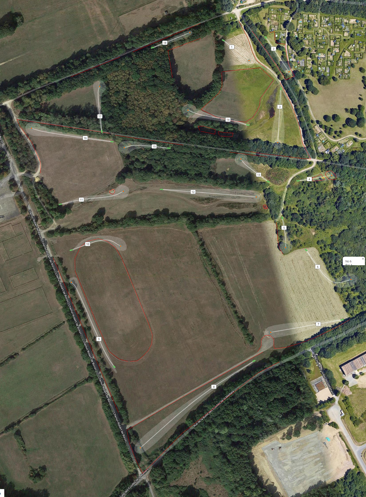

L'open de Roazhon 2020 se déroulera sur le parcours permanant de discgolf de la prévalaye à Rennes.

Le tout nouveau layout 18 corbeilles sera utilisé tel quel a peut de chose près. 
La carte général est disponible sur UDisc (Parcours de la Prévalaye, layout Blanc 18 corbeilles) et sur [Discgolf metrix (Blanc 18 - par 60)](https://discgolfmetrix.com/?u=map&ID=17722)

# Généralités

 - __Tous les chemin sans exeption sont OB (et au delà aussi)__
 - __Tous les lancer depuis le même lie on lieu imédiatement__ (ex. ReTee sur les traversée d'OB du 10 et du 14)

# Trou par trou

| Numéro | Par | Distance | Résumer des règles                                     |
|--------|-----|----------|--------------------------------------------------------|
| 1      | 3   | 70m      | OB chemin gauche et enclos long                        |
| 2      | 3   | 80m      | Double mandatory. OB autour du fairway, voir le détail |
| 3      | 3   | 95 m     | OB chemin gauche, chemin long, enclos droite et mare   |
| 4      | 3   | 60 m     | Pseudo île avec Hazard, __voir le détail__             |
| 5      | 3   | 55m      |                                                        |
| 6      | 4   | 130m     | Double mandatory, spoteur necessaire                   |
| 7      | 3   | 120m     | OB gauche et long                                      |
| 8      | 5   | 280m     | OB autour du fairway                                   |
| 9      | 4   | 180m     | OB droite et gauche                                    |
| 10     | 3   | 85m      | Enclos OB                                              |
| 11     | 3   | 115m     | Mare OB                                                |
| 12     | 4   | 17m      | Mare OB                                                |
| 13     | 3   | 70m      | Ob droite                                              |
| 14     | 3   | 115m     | Enclos a droite Ob & mare à gauche, DZ optionel        |
| 15     | 3   | 90m      | OB a droite                                            |
| 16     | 3   | 170m     | OB a droite,a gauche et long                           |
| 17     | 4   | 85m      | OB long                                                |
| 18     | 3   | 60m      | OB droite et gauche                                    |