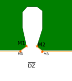

 - Un "triple mandatory" est présent à l'entrée des sous-bois

⚠️ Ce triple mandatory est en réalité composée d'un triple mandatory entouré de 2 mandatory simple pour former un "entonoire" (ce qui nous permet de tracer de belle ligne le long de la foret et ainsi simplifie la prise de décision en cas de mandatory raté)

Quelle que soit le mandatory raté (triple (M1/M2 ou simple M3/M4), on rejoue ensuite de la même dropzone. Les mandatory M3 et M4 ne sont donc pas très haut.
    
